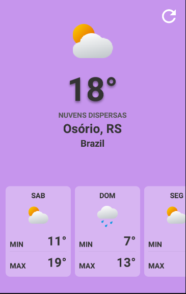

# Weather



## Utilização

Para utilizar o app, é necessário fazer uma cópia do arquivo `.env.example` e renomea-lá para `.env`. Após isso, preencha as variáveis ambientes no arquivo `.env` para o aplicativo funcionar corretamente.

Apos isto, instale as dependências utilizando um dos seguintes comandos:

```
yarn
```

```
npm install
```

Execute o Metro Bundler executando um dos seguintes comandos:

```
yarn start
```

```
npm run start
```

Após isto, para instalar o app em um dispositivo ou emulador com Android, utilize um dos seguintes comandos:

```
yarn android
```

```
npm run android
```

Alternativamente, você pode rodar instalar no iOS\* utilizando um dos seguintes comandos:

```
yarn ios
```

```
npm run ios
```

\*Por eu não possuir acesso a um dispositivo com macOS instalado, o app foi testado somente no Android, podendo não funcionar corretamente no iOS.

## Recursos

O aplicativo irá pegar a localização atual do usuário e buscar o clima na API do Open Weather. Foi utilizado a Onecall API, que fornece diversos dados com uma única chamada utilizando as coordenadas geográficas do usuário.

Também é feita a Geocodificação Reversa, utilizando as mesmas coordenadas geográficas para buscar a cidade atual em que o usuário se encontra. Para isso, se faz necesário uma chave de API do Google para a utilização da API necessária.

O aplicativo foi feito assumindo que o usuário irá possuir conexão com a internet na primeira vez que foi utilizado, e por isso não foi tratado os erros caso não exista conexão na primeira vez (não fiz estas validações mais por falta de tempo).

Após a primeira chamada com sucesso às APIs necesárias, será feito cache das informações e na proxima vez, irá carregar primeiramente os dados em cache que serão atualizados quando for feita uma chamada com sucesso. Sempre que houve sucesso em uma chamada, será feito o cache das últimas informações.

No canto superior direito da tela, existe um botão que pode ser utilizado para fazer a atualização das informações. Este botão irá pegar novamente as coordenadas geograficas do usuário e fazer as buscas necessárias nas APIs.

Na parte inferior da tela, existe uma lista horizontal que informa as temperaturas e uma previsão do clima para os próximos 7 dias.

## Notas

1. Optei por não fazer uso de Redux e Redux Saga, por não achar que fosse necessário para um projeto tão pequeno. Mas como pode ser visto em outros projetos meus no GitHub, possuo bastante experiência com o uso destas duas ferramentas.

2. Estou atualmente buscando mais conhecomento na area de arquitetura de software, e gostaria de ter implementado uma arquitetura mais robusta e escalável, porém, como é algo que ainda não tenho muita experiência, iria ter que me aprofundar mais nos estudos antes de fazer a implementação, e não conseguiria fazer dentro do tempo necessário. Ainda assim, acredito que esta estrutura esteja organizada o suficiente, extraindo praticamente toda a lógica de dentro dos componentes e colocando as mesmas em hooks e helpers.

3. Ainda sobre a arquitetura, não estou buscando apenas copiar a arquitetura de outros projetos, mas sim realmente entender os conceitos a fundo e tentar desenvolver algo por conta própria.

4. Também não consegui trabalhar tão bem a parte da interface pela questão do tempo.
